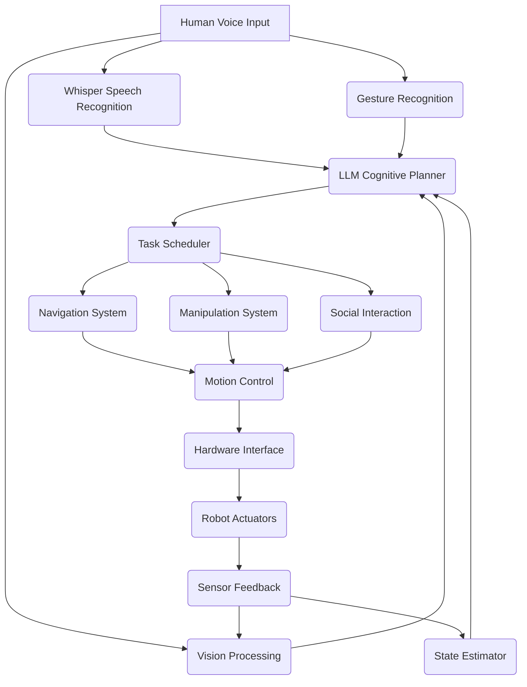

import DocCardList from '@theme/DocCardList';

## Learning Objectives

After completing this chapter, you will be able to:
- Understand the complete system architecture of the autonomous humanoid robot
- Identify how all components integrate into a cohesive system
- Recognize the data flow and communication patterns between all modules
- Appreciate the challenges and solutions in full system integration
- Evaluate the overall system performance and capabilities
- Plan for deployment and real-world operation

## Prerequisites

Before starting this chapter, you should:
- Have completed Module 1-4, especially all chapters on VLA, voice processing, cognitive planning, and multi-modal interaction
- Understand all individual components: VLA, Whisper integration, LLM planning, multi-modal fusion
- Be familiar with ROS 2 architecture and communication patterns
- Have experience with system integration and debugging
- Understand the challenges of real-time robotics systems

## Introduction

The capstone architecture represents the culmination of our journey through humanoid robotics, bringing together all the components developed throughout this book into a unified autonomous system. This integration demonstrates how vision, language, and action capabilities can work together to create a truly intelligent humanoid robot capable of understanding and responding to natural human commands in real-world environments.

The complete autonomous humanoid robot system architecture encompasses:
- **Perception Layer**: Visual, auditory, and tactile sensing
- **Cognitive Layer**: Natural language understanding and planning
- **Control Layer**: Motion and manipulation control
- **Execution Layer**: Low-level hardware control
- **Integration Layer**: ROS 2 communication and coordination

The system implements a complete pipeline: **Voice → Language Understanding → Cognitive Planning → Perception → Navigation → Manipulation → Action**, enabling robots to follow complex natural language commands in real-world environments.

## System Architecture

### High-Level Architecture

The overall system follows a layered architecture with the following key components:

```
┌─────────────────────────────────────────────────────────────────────────────┐
│                         Human User Layer                                    │
│  ┌─────────────────────────────────────────────────────────────────────┐   │
│  │                        Voice Commands                           │   │
│  │  "Go to kitchen and bring me a red cup"                         │   │
│  └─────────────────────────────────────────────────────────────────────┘   │
├─────────────────────────────────────────────────────────────────────────────┤
│                     Interface Management Layer                              │
│  ┌─────────────────┐ ┌─────────────────┐ ┌──────────────────┐              │
│  │  Voice          │ │  Gesture        │ │  Vision          │              │
│  │  Processing     │ │  Recognition    │ │  Processing      │              │
│  └─────────────────┘ └─────────────────┘ └──────────────────┘              │
├─────────────────────────────────────────────────────────────────────────────┤
│                     Cognitive Planning Layer                                │
│  ┌─────────────────┐ ┌─────────────────┐ ┌──────────────────┐              │
│  │  LLM Planner    │ │  Task          │ │  Behavior        │              │
│  │                 │ │  Scheduler     │ │  Selection       │              │
│  └─────────────────┘ └─────────────────┘ └──────────────────┘              │
├─────────────────────────────────────────────────────────────────────────────┤
│                     Action Execution Layer                                  │
│  ┌─────────────────┐ ┌─────────────────┐ ┌──────────────────┐              │
│  │  Navigation     │ │ Manipulation   │ │  Social          │              │
│  │  System         │ │  System        │ │  Interaction     │              │
│  └─────────────────┘ └─────────────────┘ └──────────────────┘              │
├─────────────────────────────────────────────────────────────────────────────┤
│                     Hardware Abstraction Layer                              │
│  ┌─────────────────┐ ┌─────────────────┐ ┌──────────────────┐              │
│  │  Isaac Sim      │ │  ROS 2         │ │  Perception      │              │
│  │  Integration     │ │  Bridge        │ │  Stack           │              │
│  └─────────────────┘ └─────────────────┘ └──────────────────┘              │
└─────────────────────────────────────────────────────────────────────────────┘
```

### Component Integration Points

The system integrates components through several key integration points:

1. **Voice Command Processing Pipeline**: Whisper → LLM → Task → Action
2. **Perception-Action Loop**: Vision → Understanding → Action → Feedback
3. **Navigation-Manipulation Coordination**: Path planning → Object detection → Grasping
4. **Multi-Modal Fusion**: Combining inputs from voice, vision, and gesture
5. **Simulation-Reality Bridge**: Transferring learned behaviors to physical robots

### Data Flow Architecture

#### Message Passing Architecture

The system uses ROS 2's pub/sub and action/service patterns for communication:



#### Shared Data Structures

The system uses standardized message types and data structures for consistency:

- **MultiModalEvents**: Structured representations of inputs from different modalities
- **FusedInteractions**: Coherent understanding combining multiple modalities
- **ActionPlans**: Sequences of robot actions with parameters and constraints
- **WorldState**: Current understanding of environment and robot state
- **ExecutionStatus**: Real-time feedback on action execution

#### Communication Protocols

Different components use appropriate communication patterns:

- **Real-time Control**: High-frequency pub/sub for joint control and sensor data
- **Task Management**: Actions for long-running operations with feedback
- **Configuration**: Services for parameter updates and system configuration
- **Monitoring**: Topic monitoring for system health and diagnostics

## Implementation Architecture

### Core System Components

#### 1. Voice Processing Module (`whisper_node.py`)
```python
class WhisperVoiceProcessor(Node):
    """
    Handles speech-to-text conversion and initial command processing.
    """
    def __init__(self):
        # Initialize Whisper model
        # Set up audio input
        # Create publishers/subscribers
        pass

    def process_audio(self, audio_msg):
        # Convert speech to text
        # Publish text for NLU
        pass
```

#### 2. LLM Cognitive Planner (`llm_planner_node.py`)
```python
class LLMBasedCognitivePlanner(Node):
    """
    Translates natural language to action plans using LLMs.
    """
    def __init__(self):
        # Initialize LLM model
        # Set up NLU components
        # Create action plan generator
        pass

    def process_command(self, text_command):
        # Parse command with LLM
        # Generate action plan
        # Publish plan for execution
        pass
```

#### 3. Multi-Modal Fusion Engine (`multi_modal_node.py`)
```python
class MultiModalInteractionNode(Node):
    """
    Fuses information from multiple modalities for coherent understanding.
    """
    def __init__(self):
        # Initialize gesture recognition
        # Set up vision processing
        # Create fusion algorithms
        pass

    def fuse_inputs(self, speech, vision, gesture):
        # Combine multi-modal inputs
        # Generate fused understanding
        # Publish for planning
        pass
```

#### 4. Navigation System (`navigation_node.py`)
```python
class HumanoidNavigationNode(Node):
    """
    Handles navigation planning and execution for humanoid robots.
    """
    def __init__(self):
        # Initialize Nav2 stack
        # Configure humanoid-specific parameters
        # Set up path planning
        pass

    def navigate_to_pose(self, pose):
        # Plan humanoid-appropriate path
        # Execute walking navigation
        # Monitor progress
        pass
```

#### 5. Manipulation System (`manipulation_node.py`)
```python
class HumanoidManipulationNode(Node):
    """
    Controls manipulation actions for humanoid robots.
    """
    def __init__(self):
        # Initialize manipulation stack
        # Configure arm control
        # Set up grasping algorithms
        pass

    def manipulate_object(self, object_info, action):
        # Plan manipulation trajectory
        # Execute grasp/place action
        # Verify success
        pass
```

### Integration Patterns

#### Event-Driven Architecture
The system uses an event-driven pattern where components react to multi-modal events:

1. **Input Events**: Voice, gesture, vision inputs trigger processing
2. **Fusion Events**: Combined understanding triggers planning
3. **Action Events**: Planned actions trigger execution
4. **Feedback Events**: Execution results update system state

#### State Management
The system maintains several state layers:

- **Perception State**: Current understanding of environment
- **Action State**: Current and pending actions
- **Social State**: Human interaction context
- **System State**: Overall system health and status

#### Error Handling and Recovery
The architecture includes robust error handling:

- **Graceful Degradation**: System continues operation with reduced capabilities
- **Fallback Behaviors**: Default responses when primary systems fail
- **Error Propagation**: Proper error reporting through system layers
- **Recovery Procedures**: Automated recovery from common failures

## Performance Considerations

### Real-Time Requirements

The system must meet strict real-time requirements:

- **Voice Processing**: &lt;100ms latency for responsive interaction
- **Vision Processing**: &lt;50ms for stable tracking
- **Planning**: &lt;200ms for timely response
- **Control**: &lt;10ms for stable robot control

### Resource Management

Efficient resource utilization is critical:

- **CPU Allocation**: Prioritized scheduling for critical components
- **GPU Utilization**: Optimized inference for perception and planning
- **Memory Management**: Efficient data structures and garbage collection
- **Bandwidth Optimization**: Compressed sensor data transmission

### Safety and Reliability

Safety considerations throughout the architecture:

- **Emergency Stop**: Immediate halt capability across all components
- **Collision Avoidance**: Continuous obstacle detection and avoidance
- **Balance Control**: Maintaining stability during all operations
- **Safe Failures**: Graceful degradation when components fail

## Hands-On Lab

### Exercise 1: System Integration Testing
Test the complete system integration:

1. Set up all system components in Isaac Sim
2. Execute end-to-end voice commands
3. Monitor data flow between components
4. Evaluate system response time and accuracy
5. Document any integration issues or delays

### Exercise 2: Performance Profiling
Profile system performance:

1. Measure processing time for each component
2. Identify bottlenecks in the pipeline
3. Optimize critical paths for real-time performance
4. Test system under various load conditions
5. Document performance characteristics

### Exercise 3: Error Handling
Test error handling capabilities:

1. Simulate component failures
2. Verify graceful degradation
3. Test recovery procedures
4. Evaluate system resilience
5. Document error scenarios and responses

## Troubleshooting

Common system integration issues and solutions:

- **Issue: Communication delays between components**: Check network configuration, optimize message sizes, and verify QoS settings.
- **Issue: Synchronization problems**: Use message_filters for temporal alignment and implement proper buffering strategies.
- **Issue: Resource contention**: Implement priority-based scheduling and resource allocation policies.
- **Issue: State inconsistency**: Implement proper state management and synchronization protocols.

## Summary

This chapter provided a comprehensive overview of the complete autonomous humanoid robot system architecture. We explored how all components from previous modules integrate into a cohesive system, the data flow patterns, and the communication protocols. The capstone architecture demonstrates the power of combining vision, language, and action capabilities to create intelligent, autonomous humanoid robots.

## Further Reading

- System Architecture Design for Robotics
- Real-Time Systems for Robotics
- Safety-Critical Robot Systems
- Multi-Agent Systems Integration

## References

For academic citations, use the references.bib file in the references/ directory.

## Exercises

1. Design an alternative architecture using a different integration pattern (e.g., centralized vs. decentralized).
2. Implement a performance monitoring system for the complete architecture.
3. Create a safety analysis for the integrated system.

<!-- Optional: Add custom components for interactive elements -->