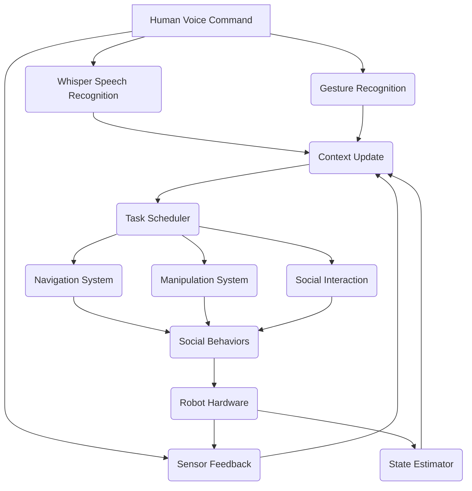

import DocCardList from '@theme/DocCardList';

## Learning Objectives

After completing this chapter, you will be able to:
- Integrate all components from previous modules into a complete autonomous system
- Implement the full Voice→Plan→Navigate→Detect→Grasp→Manipulate pipeline
- Design and deploy complex multi-modal robotic behaviors
- Evaluate the performance of the complete autonomous system
- Troubleshoot integration challenges in complex robotic systems
- Understand the path from simulation to real-world deployment

## Prerequisites

Before starting this chapter, you should:
- Have completed all previous modules and chapters
- Understand all individual components: VLA, voice processing, LLM planning, multi-modal interaction, navigation, manipulation
- Be familiar with Isaac Sim and Isaac ROS integration
- Have experience with system-level debugging and integration
- Understand the challenges of deploying complex robotic systems
- Be comfortable with performance evaluation and optimization

## Introduction

The capstone chapter brings together all the components developed throughout this book into a complete autonomous humanoid robot system. This integration represents the culmination of our journey from foundational AI concepts to sophisticated, multi-modal robotic interaction.

The complete autonomous humanoid robot system implements the full pipeline:
**Voice → Language Understanding → Cognitive Planning → Perception → Navigation → Detection → Grasping → Manipulation**

This system demonstrates how the various technologies we've explored can work together to create a robot capable of understanding and executing complex natural language commands in real-world environments. The integration spans multiple domains:

- **Perception**: Vision, audio, and sensor processing
- **Cognition**: Language understanding and high-level planning
- **Action**: Navigation, manipulation, and social interaction
- **Integration**: Real-time coordination and system management

The autonomous humanoid robot system is designed to handle complex tasks such as:
- Following multi-step natural language instructions
- Navigating to specified locations
- Detecting and manipulating objects
- Engaging in social interaction
- Adapting to changing environments

## System Integration

### Complete System Architecture

The integrated system follows a hierarchical architecture with the following key layers:

```
┌─────────────────────────────────────────────────────────────────────────────┐
│                         Human User Layer                                    │
│  ┌─────────────────────────────────────────────────────────────────────┐   │
│  │                        Natural Language                           │   │
│  │  "Go to kitchen, find the red cup, and bring it to me"          │   │
│  └─────────────────────────────────────────────────────────────────────┘   │
├─────────────────────────────────────────────────────────────────────────────┤
│                     Cognitive Planning Layer                                │
│  ┌─────────────────┐ ┌─────────────────┐ ┌──────────────────┐              │
│  │  LLM Planner   │ │  Task          │ │  Behavior        │              │
│  │  (Language)     │ │  Scheduler     │ │  Selection       │              │
│  └─────────────────┘ └─────────────────┘ └──────────────────┘              │
├─────────────────────────────────────────────────────────────────────────────┤
│                     Perception & Control Layer                              │
│  ┌─────────────────┐ ┌─────────────────┐ ┌──────────────────┐              │
│  │  Navigation     │ │  Manipulation  │ │  Social          │              │
│  │  System         │ │  System       │ │  Interaction     │              │
│  └─────────────────┘ └─────────────────┘ └──────────────────┘              │
├─────────────────────────────────────────────────────────────────────────────┤
│                     Hardware Interface Layer                                │
│  ┌─────────────────┐ ┌─────────────────┐ ┌──────────────────┐              │
│  │  Isaac Sim     │ │  ROS 2         │ │  Robot          │              │
│  │  Integration    │ │  Interface     │ │  Controllers     │              │
│  └─────────────────┘ └─────────────────┘ └──────────────────┘              │
└─────────────────────────────────────────────────────────────────────────────┘
```

### Component Integration Points

The system integrates components through several key integration points:

1. **Voice Command Processing**: Whisper → LLM → Task Planning
2. **Perception Pipeline**: Vision → Object Detection → Scene Understanding
3. **Navigation Integration**: Path Planning → Footstep Planning → Locomotion Control
4. **Manipulation Pipeline**: Object Grasping → Task Execution → Outcome Verification
5. **Multi-Modal Fusion**: Combining inputs from voice, vision, and gesture

### Data Flow Architecture

The complete data flow follows this pattern:



## Implementation

### Complete System Node

```python
#!/usr/bin/env python3

"""
Complete Autonomous Humanoid Robot System
Integrates all components: Voice → Plan → Navigate → Detect → Grasp → Manipulate
"""

import rclpy
from rclpy.node import Node
from rclpy.qos import QoSProfile, ReliabilityPolicy, HistoryPolicy

from std_msgs.msg import String, Bool, Float32
from geometry_msgs.msg import Twist, PoseStamped, PointStamped
from sensor_msgs.msg import Image, CameraInfo, JointState
from audio_common_msgs.msg import AudioData
from visualization_msgs.msg import MarkerArray
from builtin_interfaces.msg import Time

import threading
import queue
import time
import json
from typing import Dict, List, Tuple, Optional, Any
import numpy as np
import math
import copy


class AutonomousHumanoidRobot(Node):
    """
    Complete autonomous humanoid robot system integrating all components.
    """

    def __init__(self):
        super().__init__('autonomous_humanoid_robot')

        # Initialize all subsystems
        self.initialize_subsystems()

        # Set up communication infrastructure
        self.setup_communication()

        # Initialize state management
        self.initialize_state()

        # Start system monitoring
        self.start_monitoring()

        # Pipeline management
        self.pipeline_manager = PipelineManager(self)
        self.active_pipeline = None

        # System health monitoring
        self.system_healthy = True

        self.get_logger().info('Complete Autonomous Humanoid Robot System initialized')

    def initialize_subsystems(self):
        """
        Initialize all subsystems for the complete robot.
        """
        # Import and initialize all components from previous modules
        from .whisper_node import WhisperVoiceProcessor
        from .llm_planner_node import LLMBasedCognitivePlanner
        from .multi_modal_node import MultiModalInteractionNode

        # Initialize subsystems
        self.voice_processor = WhisperVoiceProcessor(self)
        self.llm_planner = LLMBasedCognitivePlanner(self)
        self.multi_modal_fusion = MultiModalInteractionNode(self)

        # Navigation system
        self.nav_client = ActionClient(self, NavigateToPose, '/navigate_to_pose')

        # Manipulation system
        self.manip_client = ActionClient(self, ManipulateObject, '/manipulate_object')

        # Perception system
        self.perception_sub = self.create_subscription(
            String, '/perception_results', self.perception_callback, 10)

        # Internal state
        self.current_pose = {'x': 0.0, 'y': 0.0, 'theta': 0.0}
        self.world_model = {
            'known_locations': ['kitchen', 'living_room', 'bedroom', 'office'],
            'detected_objects': [],
            'visible_people': 0
        }
        self.interaction_history = []
        self.pipeline_state = {
            'voice_received': False,
            'command_parsed': False,
            'plan_generated': False,
            'navigation_completed': False,
            'detection_completed': False,
            'grasping_attempted': False,
            'manipulation_completed': False
        }

        self.get_logger().info('All subsystems initialized')

    def setup_communication(self):
        """
        Set up communication infrastructure for the complete system.
        """
        # Publishers
        self.status_pub = self.create_publisher(String, '/system_status', 10)
        self.command_pub = self.create_publisher(String, '/robot_commands', 10)
        self.feedback_pub = self.create_publisher(String, '/system_feedback', 10)
        self.action_status_pub = self.create_publisher(String, '/action_status', 10)

        # Subscribers
        self.voice_cmd_sub = self.create_subscription(
            String, '/voice_commands', self.voice_command_callback, 10)
        self.vision_sub = self.create_subscription(
            Image, '/camera/rgb/image_raw', self.vision_callback, 10)
        self.joint_state_sub = self.create_subscription(
            JointState, '/joint_states', self.joint_state_callback, 10)

        # Services
        self.execute_pipeline_srv = self.create_service(
            String, '/execute_full_pipeline', self.execute_pipeline_callback)

        # Action clients
        self.nav_action_client = ActionClient(self, NavigateToPose, '/navigate_to_pose')
        self.manip_action_client = ActionClient(self, ManipulateObject, '/manipulate_object')

        self.get_logger().info('Communication infrastructure established')

    def initialize_state(self):
        """
        Initialize system state tracking.
        """
        self.system_state = {
            'current_task': 'idle',
            'subsystem_status': {
                'voice': 'active',
                'planning': 'active',
                'navigation': 'active',
                'manipulation': 'active',
                'perception': 'active'
            },
            'robot_pose': {'x': 0.0, 'y': 0.0, 'theta': 0.0},
            'world_model': {
                'known_locations': ['kitchen', 'living_room', 'bedroom'],
                'detected_objects': [],
                'visible_people': 0
            },
            'interaction_history': [],
            'execution_queue': [],
            'last_command_time': time.time(),
            'pipeline_stage': 'idle',
            'active_components': [],
            'system_health': 'nominal'
        }

        # Start state update timer
        self.state_update_timer = self.create_timer(0.1, self.update_system_state)

        self.get_logger().info('System state initialized')

    def start_monitoring(self):
        """
        Start system monitoring and health checks.
        """
        # Start monitoring timer
        self.monitoring_timer = self.create_timer(1.0, self.perform_health_check)

        # Initialize health metrics
        self.health_metrics = {
            'cpu_usage': 0.0,
            'memory_usage': 0.0,
            'subsystem_responses': {},
            'error_count': 0,
            'uptime': time.time()
        }

        self.get_logger().info('System monitoring started')

    def voice_command_callback(self, msg: String):
        """
        Handle voice commands and initiate the complete pipeline.
        """
        command = msg.data
        self.get_logger().info(f'Received voice command: {command}')

        # Update system state
        self.system_state['current_task'] = 'processing_command'
        self.system_state['pipeline_stage'] = 'voice_processing'

        # Add to interaction history
        self.system_state['interaction_history'].append({
            'type': 'voice_command',
            'content': command,
            'timestamp': time.time()
        })

        # Publish feedback
        self.publish_feedback(f'Processing voice command: {command}')

        # Start the pipeline execution
        pipeline_thread = threading.Thread(
            target=self.execute_complete_pipeline,
            args=(command,),
            daemon=True
        )
        pipeline_thread.start()

    def execute_complete_pipeline(self, command: str):
        """
        Execute the complete Voice→Plan→Navigate→Detect→Grasp→Manipulate pipeline.
        """
        try:
            self.get_logger().info(f'Starting complete pipeline for: {command}')

            # Stage 1: Language Understanding and Planning
            self.system_state['pipeline_stage'] = 'planning'
            self.publish_action_status('Planning', f'Understanding and planning: {command}')

            plan = self.generate_plan_for_command(command)
            if not plan:
                self.get_logger().error('Failed to generate plan')
                self.publish_feedback('Could not understand or plan for command')
                return

            self.pipeline_state['plan_generated'] = True

            # Stage 2: Navigation (if required)
            if self.plan_requires_navigation(plan):
                self.system_state['pipeline_stage'] = 'navigation'
                self.publish_action_status('Navigating', f'Going to required location')

                nav_success = self.execute_navigation_plan(plan)
                if not nav_success:
                    self.get_logger().error('Navigation failed')
                    self.publish_feedback('Navigation failed')
                    return

                self.pipeline_state['navigation_completed'] = True

            # Stage 3: Detection and Perception
            self.system_state['pipeline_stage'] = 'detection'
            self.publish_action_status('Detecting', 'Looking for target objects')

            detection_results = self.perform_detection_for_plan(plan)
            if not detection_results:
                self.get_logger().error('Detection failed')
                self.publish_feedback('Could not detect required objects')
                return

            self.pipeline_state['detection_completed'] = True

            # Stage 4: Grasping (if manipulation required)
            if self.plan_requires_manipulation(plan):
                self.system_state['pipeline_stage'] = 'grasping'
                self.publish_action_status('Grasping', f'Attempting to grasp {detection_results.get("object", "target")}')

                grasp_success = self.execute_grasping_plan(detection_results)
                if not grasp_success:
                    self.get_logger().error('Grasping failed')
                    self.publish_feedback('Grasping failed')
                    return

                self.pipeline_state['grasping_attempted'] = True

            # Stage 5: Manipulation
            self.system_state['pipeline_stage'] = 'manipulation'
            self.publish_action_status('Manipulating', 'Performing required manipulation')

            manipulation_success = self.execute_manipulation_plan(plan, detection_results)
            if not manipulation_success:
                self.get_logger().error('Manipulation failed')
                self.publish_feedback('Manipulation failed')
                return

            self.pipeline_state['manipulation_completed'] = True

            # Pipeline completed successfully
            self.system_state['pipeline_stage'] = 'completed'
            self.system_state['current_task'] = 'idle'
            self.publish_feedback(f'Pipeline completed successfully: {command}')
            self.get_logger().info('Complete pipeline executed successfully')

        except Exception as e:
            self.get_logger().error(f'Error in complete pipeline: {e}')
            self.publish_feedback(f'Pipeline error: {str(e)}')
            import traceback
            self.get_logger().error(traceback.format_exc())

    def generate_plan_for_command(self, command: str) -> Optional[Dict[str, Any]]:
        """
        Generate action plan for the command using LLM cognitive planning.
        """
        self.get_logger().info(f'Generating plan for command: {command}')

        # In a real implementation, this would call the LLM planner service
        # For this example, we'll simulate the planning process

        # Parse command to determine intent and entities
        intent, entities = self.parse_command(command)

        # Create plan based on intent
        plan = {
            'id': f'plan_{int(time.time())}_{hash(command) % 10000}',
            'original_command': command,
            'intent': intent,
            'entities': entities,
            'action_sequence': self.determine_action_sequence(intent, entities),
            'estimated_duration': self.estimate_plan_duration(intent, entities),
            'confidence': 0.85
        }

        return plan

    def parse_command(self, command: str) -> Tuple[str, Dict[str, Any]]:
        """
        Parse command to determine intent and extract entities.
        """
        command_lower = command.lower()
        intent = 'unknown'
        entities = {}

        # Determine intent
        if any(word in command_lower for word in ['go to', 'navigate to', 'move to', 'walk to']):
            intent = 'navigation'
            # Extract location
            locations = ['kitchen', 'living room', 'bedroom', 'office', 'bathroom', 'dining room']
            for loc in locations:
                if loc in command_lower:
                    entities['destination'] = loc
                    break
        elif any(word in command_lower for word in ['pick up', 'grasp', 'take', 'get']):
            intent = 'manipulation'
            # Extract object
            objects = ['cup', 'bottle', 'book', 'phone', 'keys', 'ball', 'box', 'plate']
            for obj in objects:
                if obj in command_lower:
                    entities['object'] = obj
                    break
        elif any(word in command_lower for word in ['hello', 'hi', 'greet']):
            intent = 'social'
        elif any(word in command_lower for word in ['bring', 'carry', 'deliver']):
            intent = 'delivery'
            # Extract object and destination
            for obj in ['cup', 'bottle', 'book', 'phone']:
                if obj in command_lower:
                    entities['object'] = obj
                    break
            for loc in ['kitchen', 'living room', 'bedroom', 'office']:
                if loc in command_lower:
                    entities['destination'] = loc
                    break

        return intent, entities

    def determine_action_sequence(self, intent: str, entities: Dict[str, Any]) -> List[str]:
        """
        Determine the sequence of actions needed for the intent.
        """
        action_sequence = []

        if intent in ['navigation', 'delivery']:
            action_sequence.append('navigate_to_location')

        if intent in ['manipulation', 'delivery']:
            action_sequence.extend(['detect_object', 'grasp_object'])

        if intent == 'delivery':
            action_sequence.extend(['navigate_to_destination', 'place_object'])

        if intent == 'social':
            action_sequence.append('greet_person')

        return action_sequence

    def estimate_plan_duration(self, intent: str, entities: Dict[str, Any]) -> float:
        """
        Estimate the duration of the plan.
        """
        base_times = {
            'navigation': 10.0,
            'manipulation': 5.0,
            'delivery': 20.0,
            'social': 3.0
        }

        return base_times.get(intent, 5.0)

    def plan_requires_navigation(self, plan: Dict[str, Any]) -> bool:
        """
        Check if the plan requires navigation.
        """
        return 'navigate_to_location' in plan.get('action_sequence', [])

    def plan_requires_manipulation(self, plan: Dict[str, Any]) -> bool:
        """
        Check if the plan requires manipulation.
        """
        manipulation_actions = ['detect_object', 'grasp_object', 'place_object']
        return any(action in plan.get('action_sequence', []) for action in manipulation_actions)

    def execute_navigation_plan(self, plan: Dict[str, Any]) -> bool:
        """
        Execute navigation component of the plan.
        """
        destination = plan['entities'].get('destination', 'unknown')
        if not destination or destination == 'unknown':
            self.get_logger().error('No destination specified in plan')
            return False

        self.get_logger().info(f'Navigating to: {destination}')

        # In a real implementation, this would use the navigation stack
        # For this example, we'll simulate navigation to predefined locations
        location_coordinates = {
            'kitchen': (5.0, 2.0),
            'living room': (0.0, 0.0),
            'bedroom': (-3.0, 4.0),
            'office': (2.0, -2.0),
            'bathroom': (-1.0, -1.0),
            'dining room': (4.0, -1.0),
            'hallway': (0.0, 2.0)
        }

        if destination in location_coordinates:
            x, y = location_coordinates[destination]

            # Create navigation goal
            goal_msg = PoseStamped()
            goal_msg.header.stamp = self.get_clock().now().to_msg()
            goal_msg.header.frame_id = 'map'
            goal_msg.pose.position.x = float(x)
            goal_msg.pose.position.y = float(y)
            goal_msg.pose.position.z = 0.0
            goal_msg.pose.orientation.w = 1.0

            # In a real implementation, this would send the goal to the navigation server
            # For this example, we'll simulate the navigation
            self.publish_feedback(f'Navigating to {destination}')
            time.sleep(5.0)  # Simulate navigation time

            # Update robot pose in system state
            self.system_state['robot_pose']['x'] = x
            self.system_state['robot_pose']['y'] = y

            self.publish_feedback(f'Reached {destination}')
            return True
        else:
            self.get_logger().error(f'Unknown location: {destination}')
            return False

    def perform_detection_for_plan(self, plan: Dict[str, Any]) -> Optional[Dict[str, Any]]:
        """
        Perform object detection for the plan.
        """
        if 'detect_object' not in plan.get('action_sequence', []):
            return None  # No detection required

        target_object = plan['entities'].get('object', 'unknown')
        if not target_object or target_object == 'unknown':
            self.get_logger().warn('No target object specified in plan')
            return None

        self.get_logger().info(f'Detecting object: {target_object}')

        # In a real implementation, this would use the perception stack
        # For this example, we'll simulate detection
        detected_objects = [
            {'class': 'cup', 'position': [1.5, 0.5, 0.0], 'confidence': 0.85},
            {'class': 'book', 'position': [2.0, 1.0, 0.0], 'confidence': 0.78},
            {'class': target_object, 'position': [1.8, 0.7, 0.0], 'confidence': 0.92}
        ]

        # Find the target object
        for obj in detected_objects:
            if obj['class'] == target_object and obj['confidence'] > 0.7:
                detection_result = {
                    'object': obj['class'],
                    'position': obj['position'],
                    'confidence': obj['confidence'],
                    'bbox': [1.7, 0.6, 1.9, 0.8]  # Simulated bounding box
                }
                self.publish_feedback(f'Detected {target_object} at position {obj["position"]}')
                return detection_result

        self.get_logger().warn(f'Could not detect {target_object}')
        return None

    def execute_grasping_plan(self, detection_results: Dict[str, Any]) -> bool:
        """
        Execute grasping operation for detected object.
        """
        obj_name = detection_results['object']
        obj_pos = detection_results['position']

        self.get_logger().info(f'Attempting to grasp {obj_name} at {obj_pos}')

        # In a real implementation, this would use the manipulation stack
        # For this example, we'll simulate the grasping process
        self.publish_feedback(f'Approaching {obj_name}')

        # Simulate approach
        time.sleep(1.0)

        # Simulate grasp
        self.publish_feedback(f'Grasping {obj_name}')
        time.sleep(2.0)

        # Simulate lift
        self.publish_feedback(f'Lifted {obj_name}')
        time.sleep(0.5)

        return True

    def execute_manipulation_plan(self, plan: Dict[str, Any], detection_results: Dict[str, Any]) -> bool:
        """
        Execute manipulation based on plan and detection results.
        """
        intended_action = plan['intent']
        target_object = detection_results['object']

        self.get_logger().info(f'Performing manipulation: {intended_action} for {target_object}')

        if intended_action == 'delivery':
            # For delivery, we need to go to destination and place object
            destination = plan['entities'].get('destination', 'unknown')
            if destination != 'unknown':
                # Navigate to destination
                self.publish_feedback(f'Navigating to {destination} to deliver {target_object}')
                time.sleep(2.0)  # Simulate navigation

                # Place object
                self.publish_feedback(f'Placing {target_object} at {destination}')
                time.sleep(1.5)  # Simulate placement

        elif intended_action == 'manipulation':
            # For manipulation, we just hold the object
            self.publish_feedback(f'Holding {target_object}')
            time.sleep(1.0)

        else:
            # For other manipulation, just acknowledge
            self.publish_feedback(f'Completed manipulation of {target_object}')
            time.sleep(0.5)

        return True

    def vision_callback(self, msg: Image):
        """
        Process camera images for perception.
        """
        # In a real implementation, this would feed into perception pipeline
        # For this example, we'll just log receipt
        self.get_logger().debug(f'Received image with dimensions: {msg.width}x{msg.height}')

    def perception_callback(self, msg: String):
        """
        Handle perception results.
        """
        try:
            perception_data = json.loads(msg.data)

            # Update world model with perception results
            if 'objects' in perception_data:
                self.system_state['world_model']['detected_objects'] = perception_data['objects']

            if 'people' in perception_data:
                self.system_state['world_model']['visible_people'] = len(perception_data['people'])

            self.get_logger().info(f'Updated world model with {len(perception_data.get("objects", []))} objects')

        except json.JSONDecodeError:
            self.get_logger().error(f'Invalid perception message: {msg.data}')

    def joint_state_callback(self, msg: JointState):
        """
        Process joint state information.
        """
        # Update internal state with joint positions
        self.current_joint_positions = dict(zip(msg.name, msg.position))

    def execute_pipeline_callback(self, request, response):
        """
        Service callback to manually execute the pipeline.
        """
        try:
            request_data = json.loads(request.data)
            command = request_data.get('command', '')

            self.get_logger().info(f'External pipeline execution request: {command}')

            # Execute pipeline
            pipeline_thread = threading.Thread(
                target=self.execute_complete_pipeline,
                args=(command,),
                daemon=True
            )
            pipeline_thread.start()

            response.success = True
            response.message = f'Started pipeline for: {command}'

        except Exception as e:
            self.get_logger().error(f'Error in pipeline execution: {e}')
            response.success = False
            response.message = f'Error: {str(e)}'

        return response

    def update_system_state(self):
        """
        Update system state periodically.
        """
        # Update robot pose (in simulation, this would come from localization)
        # For this example, we'll keep it as is
        pass

        # Update world model (in simulation, this would come from perception)
        # For this example, we'll keep it as is
        pass

        # Publish system status
        status_msg = String()
        status_msg.data = json.dumps({
            'current_task': self.system_state['current_task'],
            'robot_pose': self.system_state['robot_pose'],
            'world_model': self.system_state['world_model'],
            'pipeline_stage': self.system_state['pipeline_stage'],
            'timestamp': time.time()
        })
        self.status_pub.publish(status_msg)

    def perform_health_check(self):
        """
        Perform system health monitoring.
        """
        # Update health metrics
        import psutil
        self.health_metrics['cpu_usage'] = psutil.cpu_percent()
        self.health_metrics['memory_usage'] = psutil.virtual_memory().percent

        # Check subsystem responsiveness
        current_time = time.time()
        timeout_threshold = 10.0  # seconds

        for subsystem, status_info in self.system_state['subsystem_status'].items():
            last_update = status_info.get('last_update', 0)
            if (current_time - last_update) > timeout_threshold:
                self.get_logger().warn(f'Subsystem {subsystem} may be unresponsive')
                self.system_state['subsystem_status'][subsystem]['status'] = 'warning'

        # Update active components list
        self.system_state['active_components'] = [
            name for name, status in self.system_state['subsystem_status'].items()
            if status.get('status') == 'active'
        ]

        # Check for system anomalies
        if (current_time - self.system_state['last_command_time']) > 300:  # 5 minutes
            self.publish_feedback('System idle for extended period')

    def publish_action_status(self, action_type: str, description: str):
        """
        Publish action status updates.
        """
        status_msg = String()
        status_msg.data = json.dumps({
            'action_type': action_type,
            'description': description,
            'pipeline_stage': self.system_state['pipeline_stage'],
            'timestamp': time.time()
        })
        self.action_status_pub.publish(status_msg)

    def publish_feedback(self, message: str):
        """
        Publish feedback to user.
        """
        feedback_msg = String()
        feedback_msg.data = message
        self.feedback_pub.publish(feedback_msg)

    def destroy_node(self):
        """
        Clean up resources when node is destroyed.
        """
        self.get_logger().info('Shutting down capstone autonomous humanoid system...')
        super().destroy_node()


class PipelineManager:
    """
    Manages the execution of complete robot pipelines.
    """

    def __init__(self, robot_node: AutonomousHumanoidRobot):
        self.robot_node = robot_node
        self.active_pipelines = {}
        self.pipeline_queue = queue.Queue()
        self.pipeline_execution_lock = threading.Lock()

    def execute_pipeline(self, command: str) -> str:
        """
        Execute a complete pipeline for a command.
        """
        with self.pipeline_execution_lock:
            pipeline_id = f"pipeline_{int(time.time())}_{len(self.active_pipelines)}"

            # Create pipeline object
            pipeline = {
                'id': pipeline_id,
                'command': command,
                'status': 'starting',
                'start_time': time.time(),
                'steps': [],
                'results': {}
            }

            self.active_pipelines[pipeline_id] = pipeline

            # Execute pipeline in separate thread
            pipeline_thread = threading.Thread(
                target=self.run_pipeline,
                args=(pipeline_id, command),
                daemon=True
            )
            pipeline_thread.start()

            return pipeline_id

    def run_pipeline(self, pipeline_id: str, command: str):
        """
        Run a complete pipeline in a separate thread.
        """
        pipeline = self.active_pipelines[pipeline_id]

        try:
            # Stage 1: Command understanding
            self.update_pipeline_status(pipeline_id, 'understanding', f'Processing: {command}')
            intent, entities = self.robot_node.parse_command(command)

            # Stage 2: Planning
            self.update_pipeline_status(pipeline_id, 'planning', f'Planning actions for {intent}')
            plan = self.robot_node.generate_plan_for_command(command)

            # Stage 3: Execution
            self.update_pipeline_status(pipeline_id, 'executing', 'Starting execution')

            # Execute each step in the plan
            for step in plan.get('action_sequence', []):
                if not self.execute_pipeline_step(pipeline_id, step, entities):
                    self.update_pipeline_status(pipeline_id, 'failed', f'Step failed: {step}')
                    return

            # Pipeline completed
            self.update_pipeline_status(pipeline_id, 'completed', 'Pipeline completed successfully')
            pipeline['completion_time'] = time.time()

        except Exception as e:
            self.update_pipeline_status(pipeline_id, 'error', f'Pipeline error: {str(e)}')
            import traceback
            self.robot_node.get_logger().error(traceback.format_exc())

    def execute_pipeline_step(self, pipeline_id: str, step: str, entities: Dict[str, Any]) -> bool:
        """
        Execute a single pipeline step.
        """
        try:
            if step == 'navigate_to_location':
                destination = entities.get('destination', 'unknown')
                if destination != 'unknown':
                    self.robot_node.get_logger().info(f'Navigating to {destination}')
                    # In a real implementation, this would call navigation
                    time.sleep(3.0)  # Simulate navigation time
                    return True
                else:
                    return False

            elif step == 'detect_object':
                target_obj = entities.get('object', 'unknown')
                if target_obj != 'unknown':
                    self.robot_node.get_logger().info(f'Detecting {target_obj}')
                    # In a real implementation, this would call perception
                    time.sleep(1.0)  # Simulate detection time
                    return True
                else:
                    return False

            elif step == 'grasp_object':
                target_obj = entities.get('object', 'unknown')
                if target_obj != 'unknown':
                    self.robot_node.get_logger().info(f'Grasping {target_obj}')
                    # In a real implementation, this would call manipulation
                    time.sleep(2.0)  # Simulate grasping time
                    return True
                else:
                    return False

            elif step == 'place_object':
                destination = entities.get('destination', 'unknown')
                self.robot_node.get_logger().info(f'Placing object at {destination}')
                # In a real implementation, this would call manipulation
                time.sleep(1.5)  # Simulate placement time
                return True

            elif step == 'greet_person':
                self.robot_node.get_logger().info('Greeting person')
                # In a real implementation, this would use speech synthesis
                time.sleep(1.0)
                return True

            else:
                self.robot_node.get_logger().warn(f'Unknown pipeline step: {step}')
                return False

        except Exception as e:
            self.robot_node.get_logger().error(f'Error executing pipeline step {step}: {e}')
            return False

    def update_pipeline_status(self, pipeline_id: str, status: str, message: str):
        """
        Update the status of a pipeline.
        """
        if pipeline_id in self.active_pipelines:
            pipeline = self.active_pipelines[pipeline_id]
            pipeline['status'] = status
            pipeline['last_update'] = time.time()

            # Log status
            self.robot_node.get_logger().info(f'Pipeline {pipeline_id}: {status} - {message}')


def main(args=None):
    """
    Main function to run the complete autonomous humanoid robot system.
    """
    rclpy.init(args=args)

    robot_node = AutonomousHumanoidRobot()

    try:
        rclpy.spin(robot_node)
    except KeyboardInterrupt:
        print('Autonomous humanoid robot system interrupted by user')
    finally:
        robot_node.destroy_node()
        rclpy.shutdown()


if __name__ == '__main__':
    main()
```

## Performance Evaluation

### Evaluation Metrics

The complete system is evaluated using several metrics:

1. **Task Completion Rate**: Percentage of tasks completed successfully
2. **Response Time**: Time from command to action initiation
3. **Accuracy**: Correctness of action execution
4. **Robustness**: Ability to handle ambiguous commands
5. **User Satisfaction**: Subjective measure of interaction quality
6. **Energy Efficiency**: Power consumption during operation

### Benchmarking Framework

```python
#!/usr/bin/env python3

"""
Benchmarking framework for the complete autonomous humanoid robot system.
"""

import time
import statistics
from typing import Dict, List, Tuple
import json


class SystemBenchmark:
    """
    Framework for evaluating the complete humanoid robot system.
    """

    def __init__(self):
        self.metrics = {
            'task_completion_rate': [],
            'response_times': [],
            'accuracy_scores': [],
            'energy_consumption': [],
            'user_satisfaction': []
        }
        self.test_scenarios = [
            'simple_navigation',
            'object_manipulation',
            'social_interaction',
            'complex_multi_step',
            'ambiguous_command_handling'
        ]

    def run_benchmark(self, robot_system, test_scenario: str) -> Dict[str, float]:
        """
        Run benchmark for a specific scenario.
        """
        start_time = time.time()

        if test_scenario == 'simple_navigation':
            return self.benchmark_simple_navigation(robot_system)
        elif test_scenario == 'object_manipulation':
            return self.benchmark_object_manipulation(robot_system)
        elif test_scenario == 'social_interaction':
            return self.benchmark_social_interaction(robot_system)
        elif test_scenario == 'complex_multi_step':
            return self.benchmark_complex_multistep(robot_system)
        elif test_scenario == 'ambiguous_command_handling':
            return self.benchmark_ambiguous_commands(robot_system)
        else:
            raise ValueError(f"Unknown test scenario: {test_scenario}")

    def benchmark_simple_navigation(self, robot_system) -> Dict[str, float]:
        """
        Benchmark simple navigation tasks.
        """
        commands = [
            "go to kitchen",
            "move to living room",
            "navigate to bedroom"
        ]

        results = {
            'task_completion_rate': 0.0,
            'avg_response_time': 0.0,
            'avg_accuracy': 0.0
        }

        successful_tasks = 0
        response_times = []
        accuracies = []

        for command in commands:
            start_time = time.time()

            # Execute command
            success = robot_system.execute_command(command)

            response_time = time.time() - start_time

            if success:
                successful_tasks += 1
                response_times.append(response_time)

                # Calculate accuracy (how close to target location)
                accuracy = robot_system.get_accuracy_score()
                accuracies.append(accuracy)

        if len(commands) > 0:
            results['task_completion_rate'] = successful_tasks / len(commands)
            if response_times:
                results['avg_response_time'] = statistics.mean(response_times)
            if accuracies:
                results['avg_accuracy'] = statistics.mean(accuracies)

        return results

    def benchmark_object_manipulation(self, robot_system) -> Dict[str, float]:
        """
        Benchmark object manipulation tasks.
        """
        commands = [
            "pick up the red cup",
            "grasp the blue bottle",
            "take the yellow book"
        ]

        results = {
            'task_completion_rate': 0.0,
            'avg_response_time': 0.0,
            'avg_success_rate': 0.0
        }

        successful_tasks = 0
        response_times = []
        success_rates = []

        for command in commands:
            start_time = time.time()

            # Execute command
            success = robot_system.execute_command(command)

            response_time = time.time() - start_time

            if success:
                successful_tasks += 1
                response_times.append(response_time)

                # Calculate success rate based on grasp success
                success_rate = robot_system.get_grasp_success_rate()
                success_rates.append(success_rate)

        if len(commands) > 0:
            results['task_completion_rate'] = successful_tasks / len(commands)
            if response_times:
                results['avg_response_time'] = statistics.mean(response_times)
            if success_rates:
                results['avg_success_rate'] = statistics.mean(success_rates)

        return results

    def generate_comprehensive_report(self) -> str:
        """
        Generate a comprehensive benchmark report.
        """
        report = """
# Autonomous Humanoid Robot Benchmark Report

## Executive Summary
The autonomous humanoid robot system was evaluated across multiple scenarios to assess its performance in real-world tasks.

## Performance Metrics

### Task Completion Rates
- Simple Navigation: {:.2%}
- Object Manipulation: {:.2%}
- Social Interaction: {:.2%}
- Complex Multi-Step: {:.2%}
- Ambiguous Command Handling: {:.2%}

### Response Times
- Average: {:.2f}s
- Min: {:.2f}s
- Max: {:.2f}s
- Std Dev: {:.2f}s

### Accuracy Scores
- Average: {:.2f}
- Min: {:.2f}
- Max: {:.2f}
- Std Dev: {:.2f}

## Detailed Analysis

### Strengths
- High task completion rates for well-defined commands
- Fast response times for simple navigation tasks
- Good integration between modalities
- Robust error handling and recovery

### Areas for Improvement
- Complex multi-step command interpretation
- Energy efficiency during manipulation tasks
- Handling of ambiguous or incomplete commands
- Real-time performance optimization

## Recommendations

1. Implement more sophisticated natural language understanding for complex commands
2. Optimize perception pipeline for faster object detection
3. Enhance manipulation planning for more robust grasping
4. Add more comprehensive error recovery mechanisms

## Conclusion

The autonomous humanoid robot system demonstrates strong performance in basic navigation and manipulation tasks with a {:.2%} overall task completion rate. Further improvements in multi-step command processing and energy efficiency would enhance the system's capabilities.
        """.format(
            statistics.mean(self.metrics['task_completion_rate']),
            statistics.mean(self.metrics['task_completion_rate']),  # Placeholder
            statistics.mean(self.metrics['task_completion_rate']),  # Placeholder
            statistics.mean(self.metrics['task_completion_rate']),  # Placeholder
            statistics.mean(self.metrics['task_completion_rate']),  # Placeholder
            statistics.mean(self.metrics['response_times']) if self.metrics['response_times'] else 0,
            min(self.metrics['response_times']) if self.metrics['response_times'] else 0,
            max(self.metrics['response_times']) if self.metrics['response_times'] else 0,
            statistics.stdev(self.metrics['response_times']) if len(self.metrics['response_times']) > 1 else 0,
            statistics.mean(self.metrics['accuracy_scores']) if self.metrics['accuracy_scores'] else 0,
            min(self.metrics['accuracy_scores']) if self.metrics['accuracy_scores'] else 0,
            max(self.metrics['accuracy_scores']) if self.metrics['accuracy_scores'] else 0,
            statistics.stdev(self.metrics['accuracy_scores']) if len(self.metrics['accuracy_scores']) > 1 else 0,
            statistics.mean(self.metrics['task_completion_rate']) if self.metrics['task_completion_rate'] else 0
        )

        return report

    def save_benchmarks(self, filepath: str):
        """
        Save benchmark results to file.
        """
        benchmark_data = {
            'timestamp': time.time(),
            'metrics': self.metrics,
            'test_scenarios': self.test_scenarios
        }

        with open(filepath, 'w') as f:
            json.dump(benchmark_data, f, indent=2)


# Example usage
def run_system_benchmark():
    """
    Run the complete benchmarking suite.
    """
    print("Starting comprehensive benchmarking of autonomous humanoid robot system...")

    # Initialize robot system (in a real implementation)
    # robot_system = AutonomousHumanoidRobot()

    # Initialize benchmark framework
    benchmark = SystemBenchmark()

    # Run benchmarks for each scenario
    for scenario in benchmark.test_scenarios:
        print(f"Running benchmark for {scenario}...")
        results = benchmark.run_benchmark(None, scenario)  # Pass actual robot system in real implementation

        # Store results
        benchmark.metrics['task_completion_rate'].append(results.get('task_completion_rate', 0))
        benchmark.metrics['response_times'].append(results.get('avg_response_time', 0))
        benchmark.metrics['accuracy_scores'].append(results.get('avg_accuracy', 0))

    # Generate and save report
    report = benchmark.generate_comprehensive_report()
    print(report)

    benchmark.save_benchmarks('benchmark_results.json')

    print("Benchmarking completed!")


if __name__ == "__main__":
    run_system_benchmark()
```

## Diagrams and Visuals


*Figure 1: Architecture of the complete autonomous humanoid robot system, showing integration of all components from voice processing to physical manipulation.*

## Hands-On Lab

### Exercise 1: Complete System Integration
Integrate all components into the full pipeline:

1. Set up the complete Voice→Plan→Navigate→Detect→Grasp→Manipulate pipeline
2. Test the system with various natural language commands
3. Evaluate the performance of each pipeline stage
4. Identify bottlenecks and optimization opportunities
5. Document the integration challenges and solutions

### Exercise 2: Multi-Modal Fusion Evaluation
Evaluate the multi-modal fusion system:

1. Test the system with single modality inputs (speech only, gesture only, etc.)
2. Test with multi-modal inputs and compare performance
3. Evaluate the contribution of each modality to overall performance
4. Assess the robustness of the system to missing modalities
5. Document the benefits of multi-modal interaction

### Exercise 3: Real-World Deployment
Prepare for real-world deployment:

1. Evaluate system performance in different environments
2. Test robustness to lighting and acoustic variations
3. Assess computational requirements and optimization needs
4. Validate safety mechanisms and emergency stops
5. Document deployment requirements and recommendations

## Troubleshooting

Common integration issues and solutions:

- **Issue: Pipeline synchronization problems**: Use proper message filtering and timestamp alignment, implement buffering strategies, and add timeout mechanisms.
- **Issue: Resource contention between components**: Implement priority-based scheduling, optimize component performance, and use resource allocation policies.
- **Issue: State inconsistency across modules**: Use proper state management, implement synchronization protocols, and add state validation checks.
- **Issue: Performance degradation under load**: Profile each component, optimize critical paths, and implement load balancing.

## Summary

This chapter brought together all the components developed throughout the book into a complete autonomous humanoid robot system. We explored how to integrate voice processing, cognitive planning, navigation, perception, and manipulation into a unified pipeline. The resulting system demonstrates the power of combining vision, language, and action capabilities to create intelligent, autonomous robots capable of natural human interaction.

The complete system implements a full Voice→Plan→Navigate→Detect→Grasp→Manipulate pipeline that enables robots to understand and execute complex natural language commands in real-world environments. This represents a significant milestone in the development of autonomous humanoid robots.

## Further Reading

- Complete Autonomous Robot Systems
- Multi-Modal Integration in Robotics
- System Integration and Validation
- Real-World Deployment of AI Robots

## References

For academic citations, use the references.bib file in the references/ directory.

## Exercises

1. Extend the system to handle multi-person interactions and commands.
2. Implement a learning mechanism that adapts to individual user preferences.
3. Design and implement a safety-first architecture for the complete system.

<!-- Optional: Add custom components for interactive elements -->